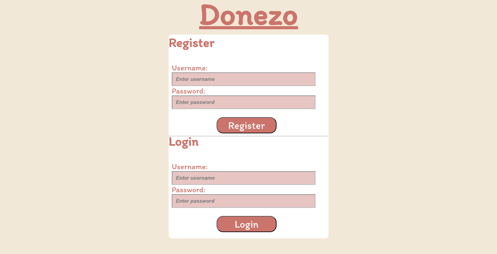

## Donezo

your glitch (or alternative server) link e.g. http://a3-wilson-wong.glitch.me

Donezo is an application for making and storing a list of task for the user to keep track of. Donezo opens to the user authentication screen where the user is able to either register for an account or log in with an existing username and password. I encountered some issues with the dynamic updating of the task list however I was able to fix the issues. I used the passport local strategy as it seemed the easiest to understand as a first time user. I tried to implement Material Tailwind as I was interested in seeing how it functioned as I have used Tailwind before, however it interfered with my implemented CSS styling and so I was not able to completely implement it.

## Technical Achievements

- **Tech Achievement 1**: I used passport-local to facilitate the user authentication of my application.

- **Tech Achievement 2**: I used MongoDB to facilitate the database for my application. This is where I stored the users' username and password as well as their tasks.

- **Tech Achievement 3**: I created a server using Express.

## Design/Evaluation Achievements

- **Design Achievements**: I followed the following tips from the W3C Web Accessibility Initiative:

- Use headings to convey meaning and structure (This was used in the headings for the forms)

- Provide clear instructions (This was done by using both the labels for the input areas as well as the place holder text to instruct the user on what to do.)

- Provide sufficient contrast between foreground and background

- Ensure that interactive elements are easy to identify (This is done by having interactive styles for the buttons and input areas)

- Ensure that form elements include clearly associated labels

- Provide easily identifiable feedback (This is done by using the alert function in the browser)

- Associate a label with every form control
